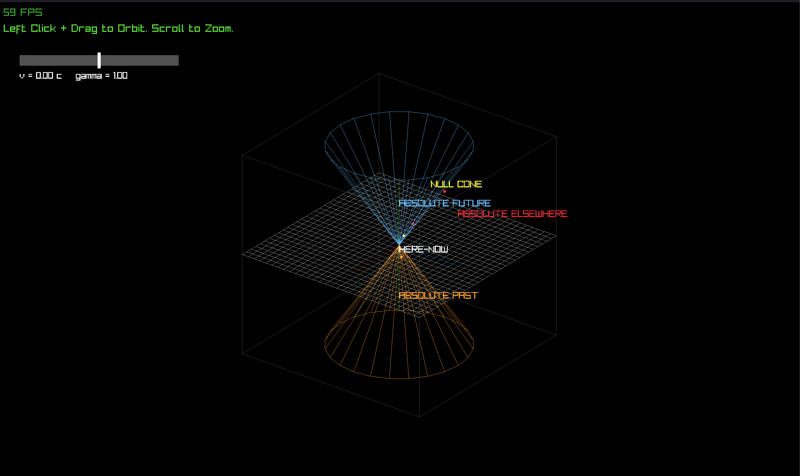

# light-cone

An interactive 3D visualization of the light cone in special relativity, written in C++ with [raylib](https://www.raylib.com/).



Every event in spacetime falls into one of five categories relative to a chosen origin event, and the program computes that classification from the spacetime interval rather than from anything about how the scene is drawn.

## What it shows

The cone is the path light takes through spacetime from a single event at the origin. Time runs vertically, two spatial dimensions lie in the horizontal plane, and units are chosen so that the speed of light is 1. That choice is what makes the cone open at exactly 45 degrees: light covers one unit of distance in one unit of time.

| Region | Meaning |
|---|---|
| Here-now | The origin event itself |
| Absolute future | Events a particle leaving the origin could reach |
| Absolute past | Events that could have sent a signal to the origin |
| Null cone | The cone surface, where light itself travels |
| Absolute elsewhere | Events with no causal connection to the origin |

"Absolute" is not decoration. Observers moving at different velocities disagree about distances, durations, and even about which of two events happened first, but they all agree on these five categories. That invariance is what the program is built around.

## The math

With `c = 1`, the spacetime interval between two events is

```
s² = -(Δt)² + (Δx)² + (Δy)² + (Δz)²
```

Its sign gives the classification directly:

- `s² > 0` — spacelike separation, no causal link, **elsewhere**
- `s² = 0` — lightlike separation, exactly on the **null cone**
- `s² < 0` — timelike separation, **inside** the cone

The sign of `Δt` then picks future from past. Five categories out of two numbers.

Unlike distance and duration, `s²` is the same in every reference frame. Boost to any velocity and it comes out unchanged, which is why classification can be done once and trusted regardless of how fast an observer is moving.

## The boost

The velocity slider applies a Lorentz transformation to every event, re-plotting it as a moving observer would measure it:

```
γ  = 1 / sqrt(1 - v²)
t' = γ(t - v·x)
x' = γ(x - v·t)
```

`y` and `z` are left alone, since motion along x does not affect the perpendicular directions.

Drag the slider and watch what moves and what does not. The events slide. The cone does not, because it is the same cone for every observer. An event on the null cone slides *along* the surface and never leaves it, since a lightlike interval stays lightlike at any velocity.

The most interesting case is an event in absolute elsewhere. Push the velocity high enough and one of the red spheres will cross from above the plane to below it, meaning two observers genuinely disagree about whether it happened before or after the origin event. It stays red the whole time. Time ordering is negotiable for spacelike separation. Causal category is not.

## Controls

| Input | Action |
|---|---|
| Left click + drag | Orbit |
| Scroll | Zoom |
| Drag the slider | Change observer velocity, -0.9c to 0.9c |

Velocity is clamped short of the speed of light because γ diverges at exactly 1.

## Building

Requires CMake and raylib.

```bash
cmake -B build
cmake --build build
./build/light_cone
```

## Verification

The program checks `classify` against six known cases on startup and prints the results to the console before opening a window. Each case targets one branch:

| Event `(t, x, y, z)` | Expected |
|---|---|
| `1, 0, 0, 0` | FutureInterior |
| `1, 1, 0, 0` | FutureCone |
| `1, 5, 0, 0` | Outside |
| `-1, 0, 0, 0` | PastInterior |
| `-1, 1, 0, 0` | PastCone |
| `0, 0, 0, 0` | Unknown |

The `1, 1, 0, 0` case is the one that matters most. It only lands on the cone if the minus sign sits on the time term, so a sign error in the interval shows up there immediately.

There is a second check that runs continuously. Every sphere is classified *after* being boosted, so if a color changes while the slider moves, the transform is wrong. Invariance is not asserted anywhere in the code. It either holds on screen or it does not.

## Roadmap

- Tilted axes, so the moving observer's coordinate grid is drawn scissoring toward the cone rather than only the events moving
- The interval printed on screen before and after the boost, as a numeric companion to the visual check
- Worldlines through the cone
- Perspective toggle, since orthographic is currently permanent
- Click to place events instead of hardcoding them

## License

MIT. See [LICENSE](LICENSE).